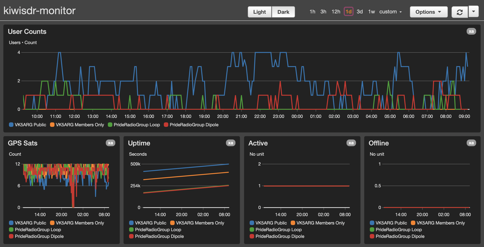

KiwiSDR CloudWatch stats monitor
==

Monitor KiwiSDRs and upload the data to CloudWatch as custom metrics.

This script operates as Lambda function in AWS to pull down KiwiSDR stats.

Deployment
--

1. Deploy the provided CloudFormation script
2. A dashboard will be deployed however you'll need to modify the template to match the hosts your monitoring and the names you want to configure them for.

How it operates
--

A CloudWatch EventBridge cron triggers a Lambda function every 5 minutes. This Lambda function performs a HTTP GET to `/status` to the KiwiSDR, parses it and uploads some core metrics to CloudWatch Metrics. A dashboard can be setup to monitor those metrics.